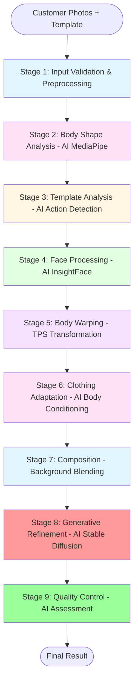
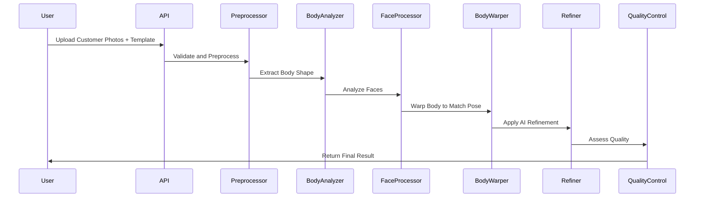

# 🎭 AI-Powered Face & Body Swap Pipeline

<div align="center">


**Transform customer photos into professional template images using advanced AI technology**

[Features](#-features) • [Quick Start](#-quick-start) • [Workflow](#-workflow-diagram) • [RunningHub Deployment](#-runninghub-deployment) • [Documentation](#-documentation)

</div>

---

## 📋 Overview

This **AI-powered face and body swap pipeline** is a fully automated system that seamlessly transplants customers into template images while preserving clothing style, pose, background, and facial expressions. The system leverages cutting-edge **Artificial Intelligence** technologies including:

- 🤖 **Stable Diffusion** for photorealistic image generation
- 🧠 **ControlNet** for precise pose and structure control
- 👁️ **InsightFace** for advanced face recognition and swapping
- 🎯 **MediaPipe** for body pose detection and analysis
- 🎨 **Segment Anything Model (SAM)** for precise segmentation

The system supports individuals, couples, families, and various body types with intelligent adaptation and natural-looking results.

---

## ✨ Features

### Core Capabilities
- ✅ **Fully Automated Processing** - End-to-end pipeline from input to output
- ✅ **AI-Powered Refinement** - Uses Stable Diffusion + ControlNet for photorealistic results
- ✅ **Multiple Subjects** - Support for individuals, couples, families, and groups
- ✅ **Body Type Adaptation** - Automatically adapts clothing to different body sizes (average, plus-size, athletic, etc.)
- ✅ **Intelligent Body Conditioning** - Enhanced support for open chest shirts with realistic skin synthesis
- ✅ **Expression Matching** - AI preserves and matches facial expressions from templates
- ✅ **Action Photo Support** - Automatic detection and handling of action poses with dynamic expressions
- ✅ **Natural Face Refinement** - Enhanced face processing to avoid plastic-looking results
- ✅ **Quality Control** - Built-in AI quality assessment and refinement capabilities
- ✅ **Manual Touch-ups** - Enhanced mask generation for precise selective refinement

### Technical Features
- 🌐 **REST API** - Full REST API for integration with web applications
- 💻 **CLI Interface** - Command-line interface for batch processing
- 🐳 **Docker Support** - Containerized deployment ready
- 📊 **Health Monitoring** - Health check and metrics endpoints
- 🔧 **Configurable** - YAML-based configuration system

---

## 🚀 Quick Start

### Prerequisites

- Python 3.8 or higher
- CUDA-capable GPU (recommended) or CPU
- 8GB+ RAM (16GB+ recommended)
- 20GB+ free disk space for AI models

### Installation

```bash
# 1. Clone repository
git clone https://github.com/Asadrammy/body-swap.git
cd body-swap

# 2. Create virtual environment
python -m venv venv
source venv/bin/activate  # On Windows: venv\Scripts\activate

# 3. Install dependencies
pip install -r requirements.txt

# 4. Configure environment
cp env.example .env
# Edit .env with your settings

# 5. Start API server
python -m src.api.main
```

The API will be available at `http://localhost:8000` with interactive documentation at `http://localhost:8000/docs`.

---

## 🔄 Workflow Diagram

The complete AI-powered pipeline consists of 9 interconnected stages:



**Alternative Text-Based Workflow:**

```
┌─────────────────────────────────────────────────────────────────┐
│                    Customer Photos + Template                    │
└────────────────────────────┬────────────────────────────────────┘
                             │
                             ▼
┌─────────────────────────────────────────────────────────────────┐
│  Stage 1: Input Validation & Preprocessing                      │
│  • AI Face Detection (InsightFace/OpenCV)                      │
└────────────────────────────┬────────────────────────────────────┘
                             │
                             ▼
┌─────────────────────────────────────────────────────────────────┐
│  Stage 2: Body Shape Analysis                                   │
│  • AI Pose Detection (MediaPipe)                               │
│  • Body Type Classification                                     │
└────────────────────────────┬────────────────────────────────────┘
                             │
                             ▼
┌─────────────────────────────────────────────────────────────────┐
│  Stage 3: Template Analysis                                     │
│  • AI Action Pose Detection                                    │
│  • Expression & Clothing Analysis                               │
└────────────────────────────┬────────────────────────────────────┘
                             │
                             ▼
┌─────────────────────────────────────────────────────────────────┐
│  Stage 4: Face Processing                                       │
│  • AI Face Recognition (InsightFace)                           │
│  • Expression Matching                                          │
└────────────────────────────┬────────────────────────────────────┘
                             │
                             ▼
┌─────────────────────────────────────────────────────────────────┐
│  Stage 5: Body Warping                                          │
│  • Thin Plate Spline Transformation                            │
│  • Pose Alignment                                               │
└────────────────────────────┬────────────────────────────────────┘
                             │
                             ▼
┌─────────────────────────────────────────────────────────────────┐
│  Stage 6: Clothing Adaptation                                   │
│  • AI Body Conditioning & Skin Synthesis                        │
│  • Clothing Scaling                                             │
└────────────────────────────┬────────────────────────────────────┘
                             │
                             ▼
┌─────────────────────────────────────────────────────────────────┐
│  Stage 7: Composition                                           │
│  • Background Blending                                          │
│  • Lighting Matching                                            │
└────────────────────────────┬────────────────────────────────────┘
                             │
                             ▼
┌─────────────────────────────────────────────────────────────────┐
│  Stage 8: Generative Refinement (AI-Powered)                     │
│  • Stable Diffusion + ControlNet                                │
│  • Photorealistic Enhancement                                   │
└────────────────────────────┬────────────────────────────────────┘
                             │
                             ▼
┌─────────────────────────────────────────────────────────────────┐
│  Stage 9: Quality Control                                       │
│  • AI Quality Assessment                                        │
│  • Mask Generation for Refinement                               │
└────────────────────────────┬────────────────────────────────────┘
                             │
                             ▼
                    ┌─────────────────┐
                    │   Final Result  │
                    └─────────────────┘
```

### Detailed Stage Breakdown

#### Stage 1: Input Validation & Preprocessing
- Validates image formats (JPEG, PNG)
- Resizes images to processing size
- **AI Face Detection**: Uses InsightFace (primary) or OpenCV (fallback)
- Supports 1-2 customer photos

#### Stage 2: Body Shape Analysis
- **AI Pose Detection**: MediaPipe Pose for body keypoints
- Extracts body measurements (shoulder, hip, waist, torso, legs)
- **AI Body Classification**: Classifies body type (average, slim, athletic, plus_size, etc.)
- Detects visible skin regions for body conditioning
- Estimates skin tone profile with gender/age detection

#### Stage 3: Template Analysis
- **AI Action Detection**: Identifies dynamic poses (running, jumping, etc.)
- Analyzes clothing items and creates masks
- **AI Expression Detection**: Detects facial expressions (neutral, happy, surprised)
- Analyzes background and lighting conditions

#### Stage 4: Face Processing
- **AI Face Recognition**: InsightFace extracts 512-dim face embeddings
- **AI Expression Matching**: Warps customer face to match template expression
- Composites face into template with seamless blending

#### Stage 5: Body Warping
- Extracts corresponding keypoints between customer and template
- Applies Thin Plate Spline (TPS) warping
- Scales template keypoints to match customer body size

#### Stage 6: Clothing Adaptation
- Calculates scale map from body measurements
- Adapts clothing items to customer proportions
- **AI Body Conditioning**: Synthesizes realistic skin for open chest shirts
- Uses face texture as reference for natural skin appearance

#### Stage 7: Composition
- Extracts template background
- Blends warped body into background
- Matches lighting conditions
- Handles occlusions and shadows

#### Stage 8: Generative Refinement (AI-Powered)
- **Stable Diffusion**: Photorealistic image generation
- **ControlNet**: Precise structure and pose control
- Face refinement with natural texture preservation
- Body and edge refinement for seamless results
- Problem area targeting with higher refinement strength

#### Stage 9: Quality Control
- **AI Quality Assessment**: Evaluates face similarity, pose accuracy, clothing fit
- Generates refinement masks for manual touch-ups
- Provides quality scores and recommendations

---

## 🎯 Face & Body Conversion Process

### Visual Conversion Flow



**Alternative Text-Based Sequence:**

```
User                    API              Preprocessor        BodyAnalyzer
 │                       │                      │                  │
 │─── Upload Photos ────>│                      │                  │
 │                       │                      │                  │
 │                       │─── Validate ────────>│                  │
 │                       │                      │                  │
 │                       │                      │─── Extract ─────>│
 │                       │                      │   Body Shape     │
 │                       │                      │                  │
 │                       │<─── Body Data ───────│<─────────────────│
 │                       │                      │                  │
 │                       │─── Process Face ────>│                  │
 │                       │                      │                  │
 │                       │─── Warp Body ───────>│                  │
 │                       │                      │                  │
 │                       │─── AI Refine ───────>│                  │
 │                       │                      │                  │
 │                       │─── Quality Check ───>│                  │
 │                       │                      │                  │
 │<─── Final Result ──────│                      │                  │
```

### Key AI Technologies Used

| Technology | Purpose | Stage |
|------------|---------|-------|
| **InsightFace** | Face detection, recognition, and embedding extraction | Stage 1, 4 |
| **MediaPipe** | Body pose detection and keypoint extraction | Stage 2 |
| **Stable Diffusion** | Photorealistic image generation and refinement | Stage 8 |
| **ControlNet** | Precise pose and structure control during generation | Stage 8 |
| **Segment Anything (SAM)** | Advanced image segmentation | Stage 3, 6 |
| **Thin Plate Spline** | Geometric body warping | Stage 5 |

---

## 🖥️ RunningHub Deployment

This project is optimized for deployment on **RunningHub GPU instances**. RunningHub provides powerful GPU resources perfect for AI model inference.

### Quick Deployment on RunningHub

#### Step 1: Prepare RunningHub Instance

```bash
# Verify GPU availability
nvidia-smi

# Install Docker and NVIDIA Container Toolkit
sudo apt-get update
sudo apt-get install -y docker.io nvidia-container-toolkit
sudo systemctl restart docker
```

#### Step 2: Clone and Configure

```bash
# Clone repository
git clone https://github.com/Asadrammy/body-swap.git
cd body-swap

# Create environment file
cp env.example .env

# Edit .env for RunningHub
# Set DEVICE=cuda
# Configure paths and ports
```

#### Step 3: Build and Deploy

```bash
# Build Docker image
docker-compose build

# Start services
docker-compose up -d

# Verify deployment
curl http://localhost:8000/health
```

#### Step 4: Configure RunningHub Networking

1. Go to RunningHub dashboard
2. Configure port forwarding: `8000 -> 8000`
3. Note the public URL provided
4. Test API access: `curl http://your-runninghub-url:8000/health`

### RunningHub-Specific Configuration

Update `docker-compose.yml` for RunningHub:

```yaml
services:
  face-body-swap:
    deploy:
      resources:
        limits:
          cpus: '4'
          memory: 16G
        reservations:
          devices:
            - driver: nvidia
              count: 1
              capabilities: [gpu]
```

### Monitoring on RunningHub

```bash
# Health check
curl http://localhost:8000/health

# Metrics endpoint
curl http://localhost:8000/metrics

# View logs
docker-compose logs -f face-body-swap
```

For detailed RunningHub deployment instructions, see **[RUNNINGHUB_DEPLOYMENT.md](RUNNINGHUB_DEPLOYMENT.md)**.

---

## 📖 Usage Examples

### Web Interface

1. Start the API server:
   ```bash
   python -m src.api.main
   ```

2. Open browser: `http://localhost:8000`

3. Upload photos and select template

4. Download your result

### CLI Usage

**Basic swap:**
```bash
python -m src.api.cli swap \
    --customer-photos customer.jpg \
    --template template.jpg \
    --output result.jpg
```

**Multiple photos (couples/families):**
```bash
python -m src.api.cli swap \
    --customer-photos photo1.jpg photo2.jpg \
    --template template.jpg \
    --output result.jpg
```

**With refinement mask:**
```bash
python -m src.api.cli swap \
    --customer-photos customer.jpg \
    --template template.jpg \
    --output result.jpg \
    --refine-mask mask.png
```

### REST API

**Create swap job:**
```bash
curl -X POST "http://localhost:8000/api/v1/swap" \
  -F "customer_photos=@customer1.jpg" \
  -F "customer_photos=@customer2.jpg" \
  -F "template=@template.jpg"
```

**Check job status:**
```bash
curl "http://localhost:8000/api/v1/jobs/{job_id}"
```

**Download result:**
```bash
curl "http://localhost:8000/api/v1/jobs/{job_id}/result" --output result.png
```

---

## 🏗️ Project Structure

```
face-body-swap/
├── src/
│   ├── pipeline/          # Core pipeline stages (9 stages)
│   │   ├── preprocessor.py
│   │   ├── body_analyzer.py
│   │   ├── template_analyzer.py
│   │   ├── face_processor.py
│   │   ├── body_warper.py
│   │   ├── clothing_adapter.py
│   │   ├── composer.py
│   │   ├── refiner.py
│   │   └── quality_control.py
│   ├── models/            # AI model wrappers
│   │   ├── generator.py   # Stable Diffusion + ControlNet
│   │   ├── face_detector.py
│   │   └── pose_detector.py
│   ├── utils/             # Utility functions
│   └── api/               # API and CLI
│       ├── main.py        # FastAPI server
│       ├── routes.py      # API routes
│       └── cli.py         # CLI interface
├── configs/               # Configuration files
│   ├── default.yaml
│   └── production.yaml
├── frontend/              # Web interface (React)
├── examples/              # Example inputs/outputs
├── tests/                 # Test suite
├── Dockerfile            # Docker configuration
├── docker-compose.yml    # Docker Compose config
└── requirements.txt      # Python dependencies
```

---

## ⚙️ Configuration

Configuration can be managed through:

1. **YAML files** in `configs/` directory
2. **Environment variables** in `.env` file
3. **Command-line arguments** (for CLI)

### Key Configuration Options

```yaml
# AI Model Configuration
models:
  generator:
    device: cuda
    model_id: "runwayml/stable-diffusion-v1-5"
    controlnet_id: "lllyasviel/sd-controlnet-openpose"
    lora_paths: []  # Add LoRA adapters here

# Processing Configuration
processing:
  image_size: 512
  max_image_size: 1024
  refinement_strength: 0.8
  region_refine_strengths:
    face: 0.65
    body: 0.55
    edges: 0.45
    problems: 0.7

# API Configuration
api:
  host: 0.0.0.0
  port: 8000
  timeout: 600
```

---

## 📚 Documentation

- **[WORKFLOW_DOCUMENTATION.md](WORKFLOW_DOCUMENTATION.md)** - Complete workflow explanation with all stages
- **[RUNNINGHUB_DEPLOYMENT.md](RUNNINGHUB_DEPLOYMENT.md)** - Detailed RunningHub deployment guide
- **[TROUBLESHOOTING_GUIDE.md](TROUBLESHOOTING_GUIDE.md)** - Comprehensive troubleshooting guide
- **[MODELS_IMPLEMENTATION.md](MODELS_IMPLEMENTATION.md)** - AI model implementation details

---

## 🔧 Troubleshooting

### Common Issues

**GPU Not Detected:**
```bash
python -c "import torch; print(torch.cuda.is_available())"
```

**Out of Memory:**
- Reduce `IMAGE_SIZE` in configuration
- Process images in smaller batches
- Use CPU mode (slower but less memory)

**Plastic-Looking Face:**
- Reduce face refinement strength to 0.5-0.6
- Check negative prompts include "plastic, artificial, CGI"
- Verify post-processing is preserving original texture

**Model Download Issues:**
- Check internet connection
- Set `HF_TOKEN` in `.env` for private models
- Manually download models to `models/` directory

For more troubleshooting, see **[TROUBLESHOOTING_GUIDE.md](TROUBLESHOOTING_GUIDE.md)**.

---

## 📊 Performance

- **Processing Time**: 30-120 seconds per image (depends on GPU)
- **Memory Usage**: 4-8GB GPU memory
- **Supported Formats**: JPEG, PNG
- **Output Resolution**: Up to 2048x2048 (configurable)

---

## 🤝 Contributing

Contributions are welcome! Please:

1. Fork the repository
2. Create a feature branch
3. Make your changes
4. Add tests
5. Submit a pull request

---

## 📄 License

[Your License Here]

---

## 🙏 Acknowledgments

This project uses the following AI technologies and libraries:

- **Stable Diffusion** (Stability AI) - Photorealistic image generation
- **ControlNet** (lllyasviel) - Precise structure control
- **InsightFace** (deepinsight) - Advanced face recognition
- **MediaPipe** (Google) - Body pose detection
- **Segment Anything** (Meta) - Advanced segmentation

---

## 🗺️ Roadmap

- [ ] Video support
- [ ] Real-time processing
- [ ] Enhanced web UI
- [ ] Batch processing improvements
- [ ] Additional body type classifications
- [ ] Advanced expression transfer
- [ ] Style transfer options

---

## 📞 Support

For issues, questions, or support:

- Open an issue on [GitHub](https://github.com/Asadrammy/body-swap/issues)
- Check the documentation
- Review troubleshooting section

---

<div align="center">

**Built with ❤️ using AI Technology**

[⭐ Star this repo](https://github.com/Asadrammy/body-swap) • [🐛 Report Bug](https://github.com/Asadrammy/body-swap/issues) • [💡 Request Feature](https://github.com/Asadrammy/body-swap/issues)

</div>
